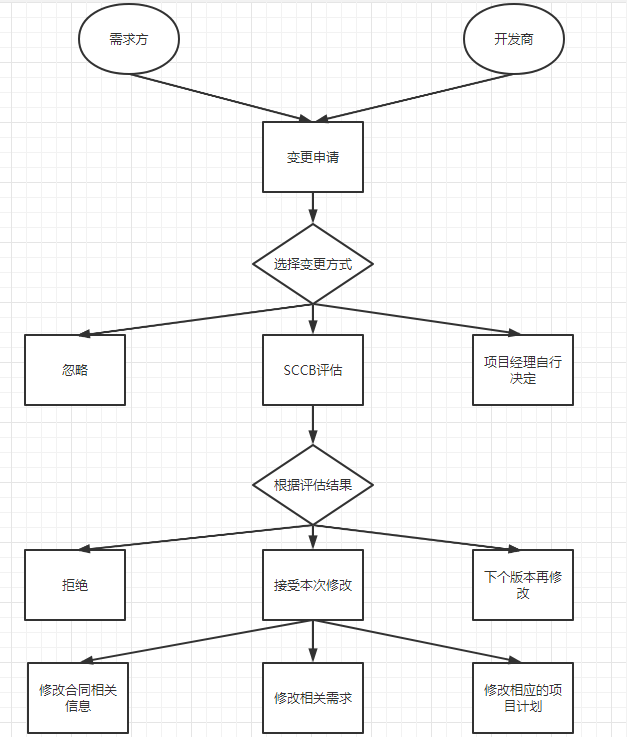

# 软件项目管理

1. 项目与软件项目概念

2. 项目的定义
    * 为了创造一个唯一的产品或提供一个唯一的服务而进行的临时性的努力

3. 项目的特征
    1. 有明确的目标
    2. 项目之间的活动具有相关性
    3. 限定的周期
    4. 有独特性
    5. 资源成本的约束
    6. 项目的不确定性

4. 提供一些条目判断是否为项目

5. 项目的特殊性
    1. 逻辑实体
    2. 相互作用的系统
    3. 变更
    4. 渐近明细

6. 项目目标的制约因素
    1. 工作范围
    2. 成本
    3. 进度计划
    4. 客户满意度

7. 什么是项目管理
    * 项目管理是一系列的伴随着项目的进行而进行的，目的是为了确保项目能够达到期望的结果的一系列管理行为

8. 项目管理的地位

9. 九大知识体系怕【旧称十大】
     1. 范围管理
     2. 时间管理
     3. 成本管理
     4. 质量管理
     5. 人力资源管理
     6. 沟通管理
     7. 风险管理
     8. 采购管理
     9. 集成管理
     10. 干系人管理

10. 过程管理与软件项目管理 P10
    1. 过程管理，是对过程进行管理，目的是要让过程能够被共享、复用，并得到持续的改进
    2. 过程管理与项目管理在软件组织中是两项最为重要的管理，项目管理保证项目的成功，过程管理用于管理最佳实践。但是两项并不是相互独立的，而是有机的、精密的结合

11. 判断一个项目适合使用哪一种模型 -> 每个模型的优缺点和适用领域
    1. 瀑布模型
        1. 需求明确
        2. 方案明确
        3. 短期项目
    2. V 模型
        1. 需求明确
        2. 方案明确
        3. 系统性能、安全有严格的要求
    3. 原型模型
        1. 需求不明确
        2. 复杂性高
        3. 变更频繁
    4. 增量模型
        1. 阶段式的提交一个可运行的产品
        2. 关键的功能更早的出现
        3. 早期预警问题，避免缺陷蔓延
        4. 阶段性完成可以降低估计失误

12. 需求分析的定义
    * 需求是指用户对软件的功能和性能的要求
    * 需求分析是为最终用户所能看到的系统建立一个概念模型，是对需求的抽象描述

13. 需求变更管理的8个步骤 【流程图】
    1. 确定需求变更控制过程
    2. 建立变更控制委员会(SCCB)
    3. 进行需求变更影响分析
    4. 跟踪所有受需求变更影响的工作产品
    5. 建立需求基准版本和需求控制版本文档
    6. 维护需求变更的历史记录
    7. 耿总每项需求的状态
    8. 衡量需求稳定性

    

14. 需求建模的基本方法
    1. 原型法
    2. 结构化方法
    3. 面向对象的用例分析方法
    4. 功能列表法

15. UML 绘图
    1. 用例视图
    2. 顺序图
    3. 状态图
    4. 活动图

16. 任务分解的定义
    * 将一个项目分解为更多的工作细目或子项目，使项目变得更小、更易管理、更易操作。

17. 分解方法(自上而下为主要)
    1. 类比
    2. 模板参照
    3. 自上而下
    4. 自下而上

18. 任务分解的基本步骤
    1. 确认并分解项目的组成要素
    2. 确认分解标准
    3. 确认分解是否详细
    4. 确认项目交付成果
    5. 验证分解的正确性

19. 检测任务分解的标准
    1. 最底层要素是否是实现目标的充分必要条件
    2. 最底层要素是否有重复的
    3. 每个要素都有清晰完整的定义
    4. 最底层要素是否有定义清晰的责任人
    5. 是否可以进行成本估算和进度安排

20. 估算方法的使用【功能点和自上而下等方法】
    1. 与实现的语言和技术没有关系
    2. 用系统的功能数量来测量其规模
    3. 通过评估、加权、量化得出功能点
    * FP = UFC * TCF

21. SCCB 是 软件配置控制委员会

22. 关键路径法估算实例
    1. 选择时间长的作为关键路径的方法

23. 进度编制的基本方法
    1. 关键路径法
    2. 时间压缩法
    3. 管理预留
    4. 资源平衡
    5. 敏捷计划

24. 进度管理图表
    1. 网络图
    2. 甘特图
    3. 里程碑图
    4. 资源图

25. 总浮动和自由浮动
    1. 浮动时间：是一个任务的机动性，它是一个任务在不影响其他任务或者项目完成的情况下可以延迟的时间量
    2. 总浮动：在不影响项目尽早完成任务的前提下，一个任务可以延迟的时间
    3. 自由浮动：在不影响后置任务最早开始时间的前提下，一个任务可以延迟的时间

26. 计算最短路径
    * 咋滴，加法还不会，需要解释？

27. 正推法、逆推法 【前者选取长度大的， 后者选取长度小的】
    1. 正推法：按照时间顺序计算最早开始时间和最早完成时间的方法 [从左到右，从上到下]
        1. 最早开始时间 ES
        2. 最早完成时间 EF
    2. 逆推法：按照逆时间顺序计算最晚开始时间和最晚结束时间的方法 [从右到左，从上到下]
        1. LS 最晚开始时间
        2. LF 最晚完成时间

28. 软件质量:
    * 软件满足明确说明或者隐含需求的程度
    1. 可移植性
    2. 可使用性
        1. 可靠性
        2. 效率
        3. 人类工程
    3. 可维护性
        1. 可测试性
        2. 可理解性
        3. 可修改性

29. 软件质量管理过程
    1. 软件质量计划
    2. 软件质量保证
    3. 软件质量控制

30. 质量计划方法
    1. 实验设计
    2. 基准对照
    3. 质量成本分析
    4. 流程图方法
    5. 因果分析图

31. SCI 软件配置型

32. 基线：
    * 基线提供了软件生存期中各个开发阶段的一个特定点
    * 一个【一些】配置项形成并通过审核，即形成基线
    * 基线的修改需要按照正式的程序执行
    * IEEE 定义 已经正式通过复审和批准的某规约或产品，它因此可作为进一步开发的基础，并且只能通过正式的变化控制过程改变

33. 项目沟通的基本原则
    1. 及时性
    2. 准确性
    3. 完整性
    4. 可理解性

34. 风险类型:
    1. 已知风险
    2. 可预测风险
    3. 不可预测风险

35. 风险管理的四个过程
    1. 风险识别
    2. 风险评估
    3. 风险规划
    4. 风险控制

36. 风险识别方法
    1. 德尔菲方法
    2. 头脑风暴法
    3. 情景分析法
    4. 利用风险条目检查表

37. 决策树分析 【EMV】
    1. EMV 注意最后的结果和每种结果的概率的乘积 极为当前分支的EMV值

38. 风险规划的输出是项目风险计划

39. 风险规划的应对策略
    1. 回避风险
    2. 转移风险
    3. 损失控制
    4. 自留风险

40. 项目执行控制步骤
    1. 建立标准
    2. 采集项目实际数据
    3. 实际结果与计划比较
    4. 决定是否修正计划
    5. 修正计划，协调各方

41. 技术评审:
    * 尽早发现工作成果中的缺陷，并帮助开发人员及时消除缺陷，从而有效地提高产品的质量

42. 软件需求管理的过程
    1. 需求确认
        1. 需求获取
        2. 需求分析
        3. 需求规格编写
        4. 需求验证
    2. 需求变更
        1. 需求变更

